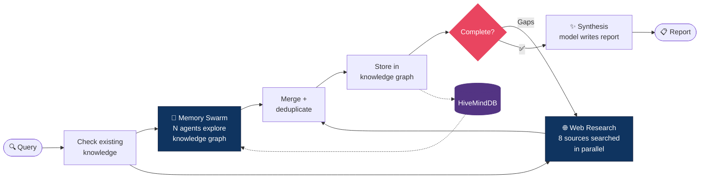

# DeepResearch

Autonomous AI research agent that accumulates knowledge over time. Searches the web and your existing knowledge graph simultaneously using parallel AI agents, then synthesizes comprehensive reports.

## Features

- **8 parallel source types** — web, arxiv, github, reddit, youtube, semantic scholar, huggingface, wikipedia
- **Memory Swarm** — parallel small-model agents explore your knowledge graph for instant recall of past research
- **Dual search** — web search and knowledge graph search run simultaneously, results merged
- **Completeness-driven** — intelligent stopping based on coverage scoring and diminishing returns, not fixed depth
- **Temporal awareness** — fact recency scoring, contradiction detection by age
- **Two-model architecture** — fast small model for extraction, any model for synthesis (vLLM, ModelGate, OpenAI, Ollama, etc.)
- **Persistent knowledge graph** — powered by [HiveMindDB](https://github.com/NodeNestor/HiveMindDB) with vector search + graph traversal
- **Web UI** — chat-like interface with real-time progress, research history, and settings
- **REST API + WebSocket** — full programmatic access with live progress streaming
- **MCP server** — 11 tools for use from Claude Code or other AI assistants
- **Fully containerized** — `docker compose up` and go

## Quick Start

```bash
git clone --recurse-submodules https://github.com/NodeNestor/DeepResearch.git
cd DeepResearch

# Configure (defaults work out of the box with a local GPU)
cp .env.example .env
# Edit .env if needed (GPU UUID, model preferences, etc.)

# Start everything
docker compose up -d

# Open the web UI
open http://localhost:8082
```

No external API keys required — all 8 sources are free and the LLM runs locally.

## How It Works



> **Key insight**: The knowledge graph grows with every research run. The Memory Swarm gives you instant recall of everything learned in past sessions, while web search finds new information. Both run at the same time — even on the first run (swarm just returns nothing from an empty DB).

### Example: What a single research run looks like

Token usage varies hugely depending on query complexity, depth, and how many sources return results. Here are real numbers from test runs on a Qwen3.5-0.8B extraction model:

| Query | Depth | Facts | Entities | Pages Fetched | LLM Calls | Total Tokens | Time |
|-------|-------|-------|----------|---------------|-----------|-------------|------|
| Simple factual question | 1 | ~34 | ~61 | ~89 | ~95 | ~800K | ~2 min |
| Broad research topic | 2 | ~109 | ~125 | ~331 | ~340 | ~2.5M | ~6 min |
| Deep open-ended topic | 3+ | ~200+ | ~200+ | ~500+ | ~550+ | ~5M+ | ~12 min |

The 0.8B model is extremely cheap to run — those millions of tokens cost nothing on local hardware. Earlier unoptimized runs with larger context windows hit 6M+ tokens on a single query. Completeness detection now stops early when returns diminish, saving significant compute.

With a 16GB GPU, the 0.8B model processes ~4,400 tokens/sec across concurrent requests, so even a 2.5M token run only needs ~10 minutes of actual GPU time.

## Architecture

```
┌──────────────────────────────────────────────────────────────────┐
│                       docker compose up                          │
│                                                                  │
│  ┌──────────┐  ┌───────────┐  ┌──────────────┐  ┌───────────┐  │
│  │ SearXNG  │  │ HiveMindDB│  │ DeepResearch │  │   vLLM    │  │
│  │ :8888    │  │ :8100     │  │ :8082        │  │   :8000   │  │
│  │          │  │           │  │              │  │           │  │
│  │ Meta-    │  │ Knowledge │  │  Web UI      │  │ Extraction│  │
│  │ search   │◄─┤ graph +   │◄─┤  REST API    │─►│ model     │  │
│  │ engine   │  │ vector DB │  │  WebSocket   │  │ (small)   │  │
│  │          │  │           │  │  MCP Server  │  │           │  │
│  └──────────┘  └───────────┘  └──────┬───────┘  └───────────┘  │
│                                      │                           │
│            deepresearch-net          │                           │
└──────────────────────────────────────┼───────────────────────────┘
                                       │
                                       ▼
                              ┌──────────────────┐
                              │ Synthesis model   │
                              │ (any provider)    │
                              │                   │
                              │ ModelGate, OpenAI, │
                              │ Ollama, vLLM, ... │
                              └──────────────────┘
```

## Two-Model Architecture

| Role | Default | Purpose |
|------|---------|---------|
| **Extraction** | Qwen3.5-0.8B (local vLLM) | Fast: query generation, fact extraction, memory swarm agents |
| **Synthesis** | Configurable | Smart: final research report. Can be any OpenAI-compatible endpoint |

The synthesis model can be a completely different provider. For example:
- Use **vLLM** locally for extraction, **ModelGate** for synthesis
- Use **Ollama** for extraction, **OpenAI** for synthesis
- Use the same local model for both

Configure via the web UI Settings page or the `PUT /api/config` endpoint.

## Web UI

The integrated web UI at `http://localhost:8082` provides:

- **Research page** — chat-like interface with Quick/Deep mode toggle and depth slider
- **History page** — browse past research sessions with full reports and token stats
- **Settings page** — configure extraction model, synthesis model, service URLs, research defaults, and appearance

## API

### REST

```bash
# Health check
GET /api/health

# Get/update runtime config
GET /api/config
PUT /api/config   {"synthesis_api_url": "http://modelgate:8989/v1", "synthesis_model": "gpt-4o"}

# Full research (blocks until complete)
POST /api/research   {"query": "topic", "depth": 3}

# Async research (returns immediately)
POST /api/research/async   → {"session_id": "abc123"}

# Get results
GET /api/research/{session_id}

# List all sessions
GET /api/sessions
```

### WebSocket

```javascript
const ws = new WebSocket('ws://localhost:8082/ws');
ws.send(JSON.stringify({ session_id: 'abc123' }));
// Receive: live progress updates per phase
```

### MCP Server

Register with Claude Code:
```bash
claude mcp add deepresearch -- python -m orchestrator.src.main mcp
```

11 tools available:
- `deep_research` — full pipeline with memory swarm + completeness loop
- `quick_search` — single-pass, no deepening
- `recall` — semantic search over stored knowledge
- `graph_explore` — traverse knowledge graph from entity
- `temporal_view` — facts within time range
- `source_credibility` — check URL reliability
- `research_status` — running task status
- `memory_swarm` — run swarm agents on existing knowledge only
- `add_knowledge` — manually add a fact to the graph
- `find_contradictions` — find contradicting facts on a topic
- `research_history` — list past research sessions

## Configuration

All config via `.env` (see `.env.example`) or the web UI Settings page.

Settings changed via the web UI take effect immediately without restart and persist across container restarts.

### Key Settings

| Variable | Default | Description |
|----------|---------|-------------|
| `BULK_MODEL` | `Qwen/Qwen3.5-0.8B` | Extraction model (HuggingFace ID) |
| `BULK_API_URL` | `http://vllm:8000/v1` | Extraction model endpoint |
| `SYNTHESIS_MODEL` | `Qwen/Qwen3.5-0.8B` | Synthesis model (any name) |
| `SYNTHESIS_API_URL` | `http://vllm:8000/v1` | Synthesis endpoint (can be different provider) |
| `GPU_DEVICE` | `GPU-3ad3e2fe` | GPU UUID for vLLM |
| `MAX_DEPTH` | `3` | Max research iterations |
| `MAX_CONCURRENT_LLM` | `100` | Parallel LLM calls |

## Requirements

- Docker + Docker Compose
- NVIDIA GPU (16GB+ recommended) with recent drivers
- No external API keys required

Optional keys for higher rate limits:
- `GITHUB_TOKEN` — GitHub API
- `HF_TOKEN` — HuggingFace private repos

## Project Structure

```
DeepResearch/
├── docker-compose.yml          # All 4 services
├── orchestrator/
│   ├── Dockerfile              # Multi-stage: Node (frontend) + Python (backend)
│   ├── pyproject.toml
│   ├── frontend/               # React + Vite + Tailwind web UI
│   │   └── src/
│   └── src/
│       ├── main.py             # FastAPI + static frontend + WebSocket + MCP
│       ├── config.py           # Settings + runtime config API
│       ├── research.py         # Main pipeline (parallel dual search)
│       ├── core/               # Completeness detection, temporal scoring
│       ├── agent/              # Memory swarm (parallel graph-exploring agents)
│       ├── llm/                # Provider-agnostic LLM client + prompts
│       ├── sources/            # 8 source modules
│       ├── storage/            # HiveMindDB client
│       └── mcp/                # MCP tool definitions
├── hiveminddb/                 # Git submodule → NodeNestor/HiveMindDB
├── searxng/                    # SearXNG config
└── vllm/                       # vLLM Docker config
```

## License

MIT
